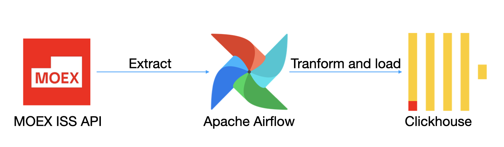

# MOEX ETL Pipeline

## Архитектура



## Стек

#### Источник данных:

- MOEX ISS API - источник финансовых данных

#### Обработка и загрузка данных:

- Pandas языка Python для выгрузки и трансформации с данными
- Clickhouse-client на Python для загрузки данных в Clickhouse

#### Хранилище данных:
- Clickhouse - колоночная аналитиическая СУБД

#### Оркестрация и инфраструктура:
- Apache Airflow - платформа управления обработкой данных, использовалась для оркестрации ETL пайплайна
- Docker для контеризации и развертывания всех сервисов

## Структура данных в таблице:

``` sql
CREATE TABLE analytics.moex
(
	SECID String,
    BOARDID_x String,
    PREVPRICE Float64,
    SHORTNAME String,
    SECNAME String,
    LOTSIZE Int64,
    LAST Float64,
    OPEN Float64,
    LOW Float64,
    HIGH Float64,
    extracted_at DateTime DEFAULT now()
)
ENGINE = MergeTree()
ORDER BY (SECID, extracted_at)
